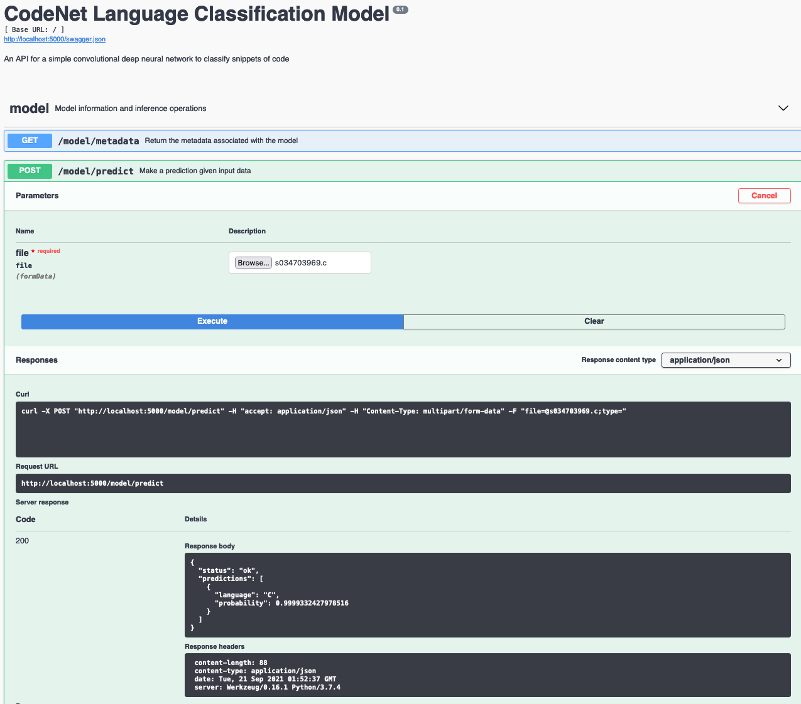

<!-- [](https://travis-ci.com/IBM/[MODEL REPO NAME]) [](http://codenet-language-classifier.max.us-south.containers.appdomain.cloud/) -->

<!-- [](http://ibm.biz/max-to-ibm-cloud-tutorial) -->

# IBM Developer Model Asset Exchange: CodeNet Language Classification

This repository contains code to instantiate and deploy a Code Language Classification Model.
The model takes in a file (any format) with a computer program / code in it and outputs the detected programming language along with the probability. 

The model is based on a simple CNN architecture with fully connected flat layers. The model files are hosted along with this repository on GitHub
The code in this repository deploys the model as a web service in a Docker container. This repository was developed
as part of the [IBM Developer Model Asset Exchange](https://developer.ibm.com/exchanges/models/) and the public API is powered by [IBM Cloud](https://ibm.biz/Bdz2XM).

## Model Metadata
| Domain | Application | Industry  | Framework | Training Data | Input Data Format |
| ------------- | --------  | -------- | --------- | --------- | -------------- | 
| Text Classification | Code Classification | Software | TensorFlow | [Project Codenet](https://developer.ibm.com/exchanges/data/all/project-codenet/) | Various coding language formats |

## References


* [Project CodeNet Dataset page](https://developer.ibm.com/exchanges/data/all/project-codenet/)
* [Project CodeNet GitHub repo](https://github.com/IBM/Project_CodeNet)

## Licenses

| Component | License | Link  |
| ------------- | --------  | -------- |
| This repository | [Apache 2.0](https://www.apache.org/licenses/LICENSE-2.0) | [LICENSE](LICENSE) |
| Model Weights | [Apache 2.0](https://www.apache.org/licenses/LICENSE-2.0) | [LICENSE](LICENSE) |
| Model Code (3rd party) | [Apache 2.0](https://www.apache.org/licenses/LICENSE-2.0) | [LICENSE](LICENSE) |
| Test samples | [CDLA-Permissive 2.0](https://cdla.io) | [samples README](samples/README.md) |

## Pre-requisites:

* `docker`: The [Docker](https://www.docker.com/) command-line interface. Follow the [installation instructions](https://docs.docker.com/install/) for your system.
* The minimum recommended resources for this model is [SET NECESSARY GB] Memory and [SET NECESSARY CPUs] CPUs.
* If you are on x86-64/AMD64, your CPU must support [AVX](https://en.wikipedia.org/wiki/Advanced_Vector_Extensions) at the minimum. [Remove this item if it's not TensorFlow-based.]

# Deployment options

* [Deploy from Quay](#deploy-from-quay)
* [Deploy on Red Hat OpenShift](#deploy-on-red-hat-openshift)
* [Deploy on Kubernetes](#deploy-on-kubernetes)
* [Run Locally](#run-locally)

## Deploy from Quay

To run the docker image, which automatically starts the model serving API, run:

```
$ docker run -it -p 5000:5000 quay.io/codait/codenet-language-classifier
```

This will pull a pre-built image from the Quay.io container registry (or use an existing image if already cached locally) and run it.
If you'd rather checkout and build the model locally you can follow the [run locally](#run-locally) steps below.

## Deploy on Red Hat OpenShift

You can deploy the model-serving microservice on Red Hat OpenShift by following the instructions for the OpenShift web console or the OpenShift Container Platform CLI [in this tutorial](https://developer.ibm.com/tutorials/deploy-a-model-asset-exchange-microservice-on-red-hat-openshift/), specifying `quay.io/codait/codenet-language-classifier` as the image name.

## Deploy on Kubernetes

You can also deploy the model on Kubernetes using the latest docker image on Quay.

On your Kubernetes cluster, run the following commands:

```
$ kubectl apply -f https://github.com/CODAIT/MAX-CodeNet-Language-Classification/raw/main/codenet-language-classifier.yaml
```

The model will be available internally at port `5000`, but can also be accessed externally through the `NodePort`.

A more elaborate tutorial on how to deploy this MAX model to production on [IBM Cloud](https://ibm.biz/Bdz2XM) can be found [here](http://ibm.biz/max-to-ibm-cloud-tutorial).

## Run Locally

1. [Build the Model](#1-build-the-model)
2. [Deploy the Model](#2-deploy-the-model)
3. [Use the Model](#3-use-the-model)
4. [Development](#4-development)
5. [Cleanup](#5-cleanup)


### 1. Build the Model

Clone this repository locally. In a terminal, run the following command:

```
$ git clone https://github.com/CODAIT/MAX-CodeNet-Language-Classification.git
```

Change directory into the repository base folder:

```
$ cd MAX-CodeNet-Language-Classification
```

To build the docker image locally, run: 

```
$ docker build -t codenet-language-classifier .
```

All required model assets will be downloaded during the build process. _Note_ that currently this docker image is CPU only (we will add support for GPU images later).


### 2. Deploy the Model

To run the docker image, which automatically starts the model serving API, run:

```
$ docker run -it -p 5000:5000 codenet-language-classifier
```

### 3. Use the Model

The API server automatically generates an interactive Swagger documentation page. Go to `http://localhost:5000` to load it. From there you can explore the API and also create test requests.

Use the `model/predict` endpoint to load a test file (you can use one of the test files from the `samples` folder) and get predicted language and probabilites from the API.



You can also test it on the command line, for example:

```
$ curl -X POST "http://localhost:5000/model/predict" -H  "accept: application/json" -H  "Content-Type: multipart/form-data" -F "file=@s034703969.c;type="
```

You should see a JSON response like that below:

```json
{
  "status": "ok",
  "predictions": [
    {
      "language": "C",
      "probability": 0.9999332427978516
    }
  ]
}
```

### 4. Development

To run the Flask API app in debug mode, edit `config.py` to set `DEBUG = True` under the application settings. You will then need to rebuild the docker image (see [step 1](#1-build-the-model)).

### 5. Cleanup

To stop the Docker container, type `CTRL` + `C` in your terminal.
